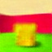

# Disentangling by VAE
* Disentangled Representation Learning VAE Repository
* VAE, Beta-VAE are available.

# Preview
<p align="center">
  <table>
    <tr>
      <td align="center"><br><em>Ground Truth</em></td>
      <td align="center"><br><em>Reconstruction</em></td>
      <td align="center"><br><em>Intervention (wall)</em></td>
    </tr>
  </table>
</p>


# How to use
### 1. Setings
* Download dataset here > <a href="https://github.com/google-deepmind/3d-shapes">Google Deepmind: 3D Shapes</a>
```
conda create -n drl_base python=3.12
conda activate drl_base
pip install -r requirements.txt

# Download 3dshapes.h5 and put it in the 'data' directory.
python subtasks/data_save/exec.py # This will save images and labels for the PyTorch dataset.
```

### 2. Train, Test, and Intervention(Manipulation)
```
# Train
python train.py --config=vae.3dshapes

# Test
python test.py --config=vae.3dshapes

# Intervention(Manipulation)
python subtasks/intervention/exec.py --config=vae.3dshapes
```